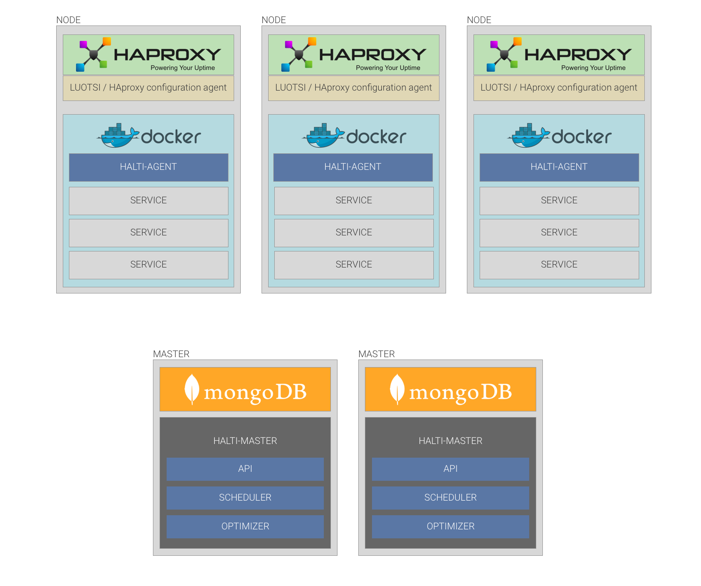

# Introduction to halti-server

### Architecture

Halti has two essential components. Master-nodes and Worker-nodes.

#### Workers
- Run Halti agent
- Send heartbeat for master
- Try to maintain master set state

#### Masters
- Run Halti-server
- Provide API for the cluster
- Schedule and optimize services between healthy worker nodes
- Keep only one master scheduler as active in same time

